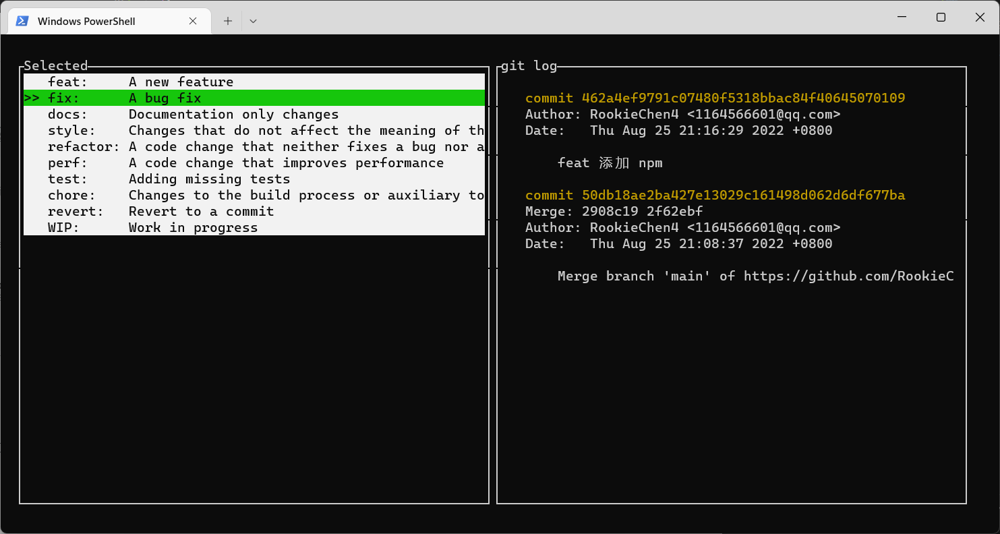

# git-commitizen
简单的git自定义提交工具, 如commitizen

## Install

```bash
npm i rcz-cli
```
#### package.json
```javascript
"scripts": {
    "rcz": "rcz"
},
```
## Usage

### 自定义配置文件
`messages 为 提交执行的流程顺序 根据type寻找json中是否配置选项`
```javascript
{
  "ChangeType": [
    {"value": "feat",     "name": "feat:     A new feature"},
    {"value": "fix",      "name": "fix:      A bug fix"},
    {"value": "docs",     "name": "docs:     Documentation only changes"},
    {"value": "style",    "name": "style:    Changes that do not affect the meaning of the code\n            (white-space, formatting, missing semi-colons, etc)"},
    {"value": "refactor", "name": "refactor: A code change that neither fixes a bug nor adds a feature"},
    {"value": "perf",     "name": "perf:     A code change that improves performance"},
    {"value": "test",     "name": "test:     Adding missing tests"},
    {"value": "chore",    "name": "chore:    Changes to the build process or auxiliary tools\n            and libraries such as documentation generation"},
    {"value": "revert",   "name": "revert:   Revert to a commit"},
    {"value": "WIP",      "name": "WIP:      Work in progress"}
  ],
  "Scopes": [
    {"value": "accounts", "name": "描述1"},
    {"value": "admin", "name": "描述2"},
    {"value": "exampleScope", "name": "描述3"},
    {"value": "changeMe", "name": "描述4"}
  ],
  "messages": [
    {"index": 1, "type": "MissionId", "placeholder": "请输入任务ID"},
    {"index": 2, "type": "ChangeType", "placeholder": "请选择变更类型"},
    {"index": 3, "type": "Scopes", "placeholder": "请输入变更范围"},
    {"index": 4, "type": "Subject", "placeholder": "请入变更概述"}
  ]
}
```

### 截图
